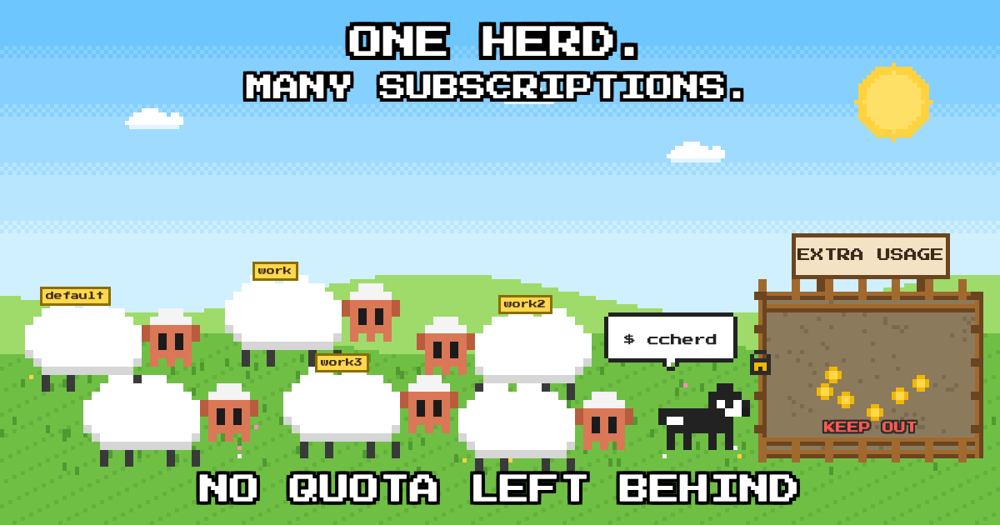

# ccherd



Run Claude Code subagents across several Claude accounts.

If you have more than one Claude subscription, each lives in its own
`CLAUDE_CONFIG_DIR` (`~/.claude`, `~/.claude-work`, ...). Claude Code only sees
the sessions of the account it runs under, and a subagent always spends the
quota of its parent. ccherd fixes both:

- it lists and messages sessions across all your accounts, and
- it starts background subagents on the account whose weekly quota is most
  likely to expire unused, so you use what you pay for before paying extra.

macOS and Linux. Needs Python 3.10+ and the `claude` CLI.

## Install

```sh
uv tool install ccherd
# or
pipx install ccherd
```

## Setup

Run this inside the repo where you want to use ccherd:

```sh
ccherd setup
```

It asks:

0. **Whether each subscription already has its own config dir.** If not, it asks
   how many subscriptions you have, creates numbered dirs next to your current
   one (`~/.claude`, `~/.claude-2`, ...), prints the command to log in to each,
   and stops. Log in, then run `ccherd setup` again.
1. **Which organization.** If your dirs are logged in to more than one (say a
   private plan and a company team), ccherd uses one of them: subagents should
   run with the same skills and memories as their caller. Dirs of other
   organizations are left out, even if a pattern matches them.
2. **Which config dirs are your accounts.** It lists every `~/.claude*` dir.
   A numbered family like `~/.claude-work`, `~/.claude-work2`, `~/.claude-work3`
   gets one extra line: tick it to save the pattern, so `~/.claude-work4` is
   picked up later without running setup again. Or tick single dirs. Anything
   elsewhere goes into the "Other" line.
3. **Where to put the Claude skill:** in this repo (`.claude/skills/ccherd`) or in
   every account's config dir.
4. **Whether to add a short note to `CLAUDE.local.md`.** Creates the file if needed and
   adds it to `.gitignore`.

At the end it runs `ccherd doctor`.

## Shared skills and memories

A subagent should behave like the session that started it. So all accounts
should share `skills`, `projects` (memories and conversations), `agents`,
`plugins`, `settings.json` and `CLAUDE.md`: one account holds them, the others
symlink to it. `ccherd doctor` shows what is linked; `ccherd doctor --fix`
links the rest. An account's own copy is merged into the shared one first;
files that differ stay in a `*.ccherd-backup-*` dir next to it. Nothing is
deleted.

Every question has a flag, so setup also runs without a terminal:
`ccherd setup --list` shows what there is, then for example
`ccherd setup --organization "Acme" --schema ~/.claude-work --skill repo --claude-local`.
`ccherd setup --help` lists all flags.

### Let your agent do it

Point your agent at this repo and tell it:

> Set up ccherd for me, following https://raw.githubusercontent.com/bocode-labs/ccherd/main/docs/agent-setup.md

It installs ccherd, shows you what it found, asks you the few questions that
are yours to answer, and checks the result with `ccherd doctor`. Logging in to
a new account opens a browser, so that part stays with you.

Config is stored in `~/.config/ccherd/config.json`.

## Commands

`ccherd --help` explains every command and all its arguments.

| Command | What it does |
| --- | --- |
| `ccherd setup` | Pick accounts, install the skill |
| `ccherd doctor` | Per account: login, organization, token, shared config |
| `ccherd doctor --fix` | Symlink every account's skills, memories etc. to one shared place |
| `ccherd usage` | Every limit per account as a bar, plus extra usage spent |
| `ccherd config` | Show settings; `ccherd config when-saturated use` changes one |
| `ccherd accounts` | 5-hour and weekly usage per account, and which one `auto` picks |
| `ccherd sessions` | Live Claude sessions of all accounts |
| `ccherd spawn NAME "task" --model M` | Start a background subagent on the best account |
| `ccherd agents` | Subagents started by the current session |
| `ccherd send TARGET "text"` | Message a subagent (resumes it if idle) or any live session |
| `ccherd result NAME` | A subagent's last answer |
| `ccherd log NAME` | A subagent's transcript |
| `ccherd kill NAME` | Stop a subagent |

`spawn`, `agents`, `send`, `result`, `log` and `kill` are meant to be run by
Claude from inside a session; the skill tells it how. A finished subagent
reports back to the session that started it as a message.

## How `auto` picks an account

Score = weekly % left ÷ hours until the weekly reset × free share of the 5-hour
window. The highest score wins. Accounts at ≥ 90 % of their 5-hour window or
≥ 98 % of their week are skipped.

When every account is past its limits, `spawn` refuses by default.
`ccherd config when-saturated use` makes it spawn anyway, on an account that
has extra usage enabled. The limits themselves are settings too
(`five-hour-limit`, `weekly-limit`). Change them any time.

ccherd never refreshes an OAuth token itself - the refresh token rotates, so
that would log out the Claude Code instance that owns the account. When an
access token has expired and no session runs on that account, it lets Claude
Code renew it (`claude auth status`).

## Contributing

If you are using this and have trouble during setup: we welcome PRs that
improve it for everyone. If you ran the setup through an agent and something
did not go smoothly, please open a PR too.

## Development

```sh
PYTHONPATH=src python3 -m unittest discover -s tests
```

## License

MIT
